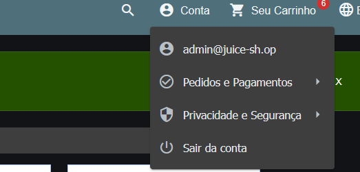
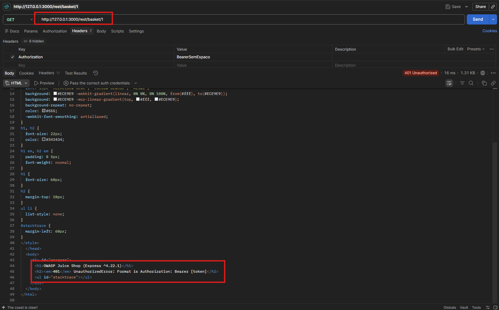
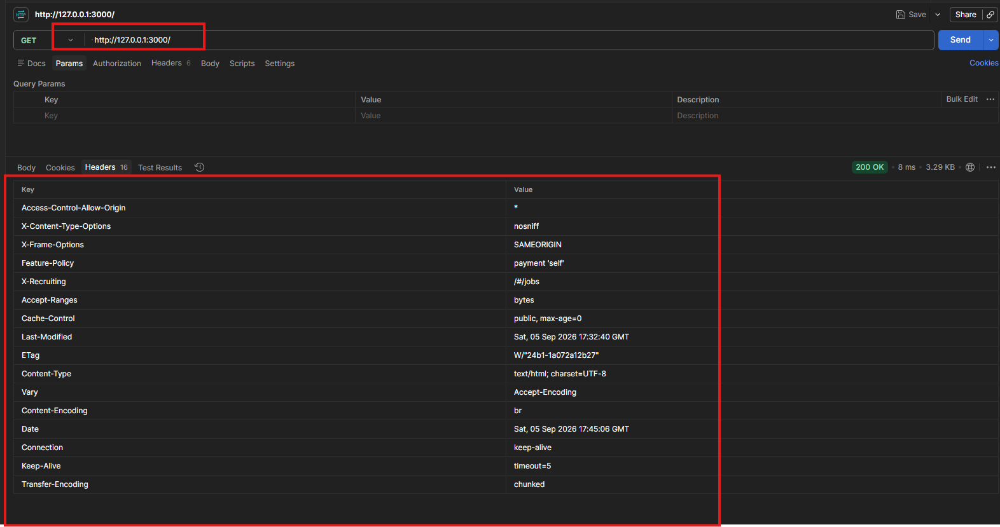
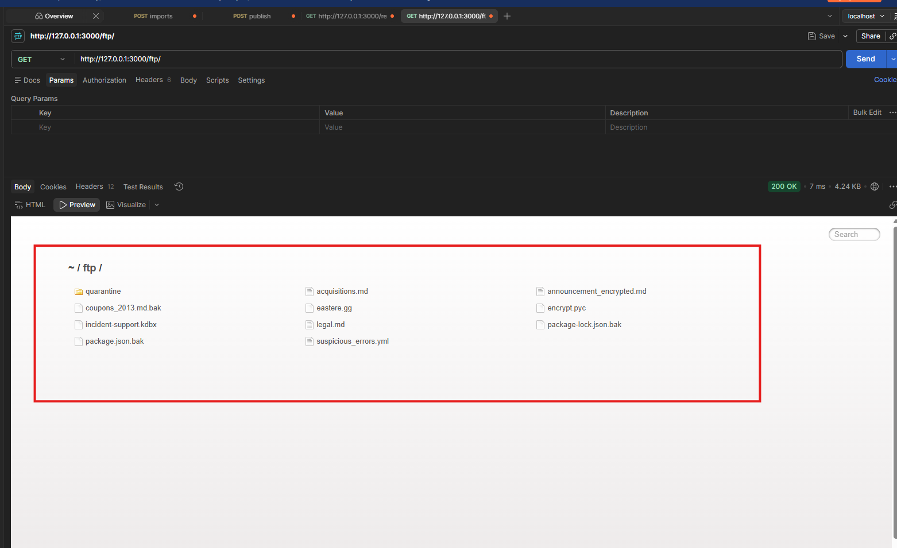
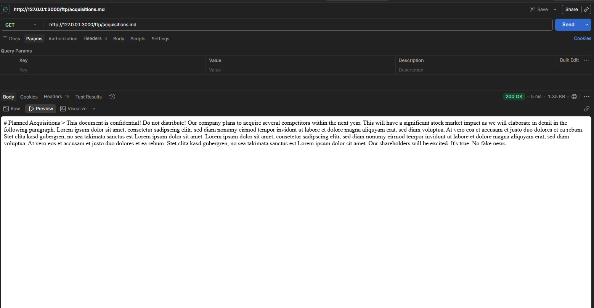
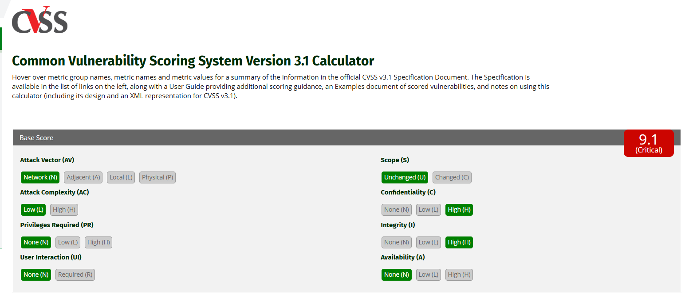
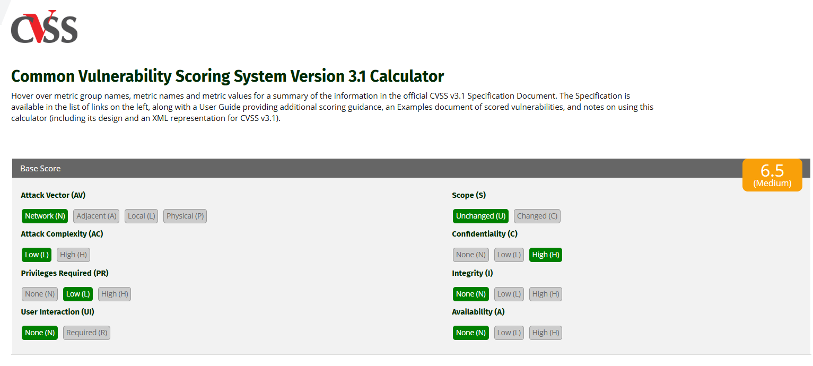
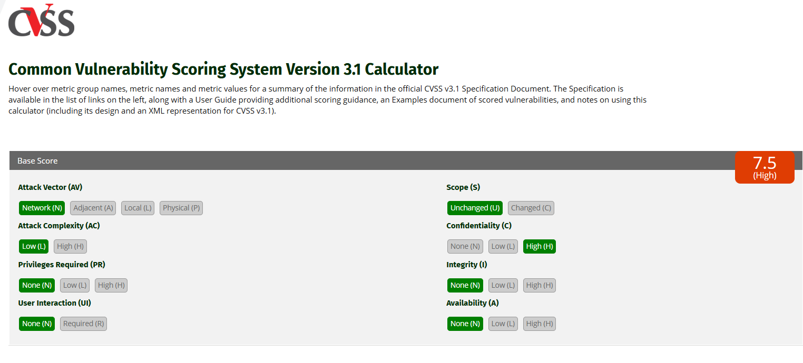
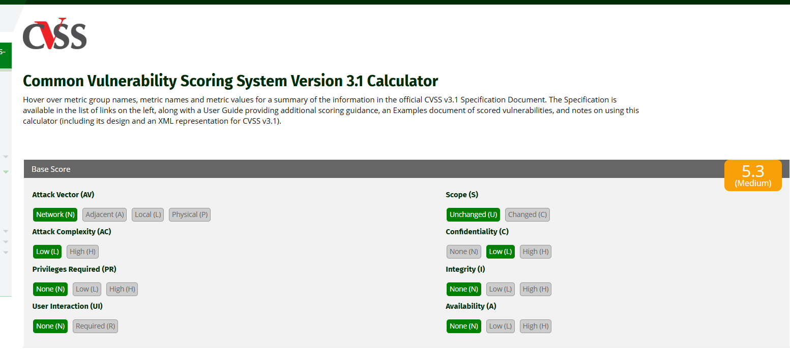
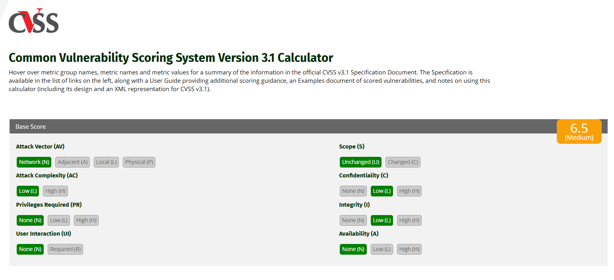

# Evidências por achado

Três camadas de evidência, complementares entre si:

1. **Capturas de tela** (nesta página), do navegador, do Postman e da calculadora oficial do FIRST, mostrando cada achado acontecendo visualmente.
2. **Pastas por achado** (`V1-sqli-login/`, `V2-hash-senha-jwt/`, `V3-idor-cesta/`, `V4-erro-verboso-headers/`, `V5-listagem-diretorio-ftp/`, `V6-bruteforce-login/`, `V7-reset-senha-pergunta-seguranca/`), com a requisição e a resposta HTTP completas em texto (`http/NN-request.http` / `NN-response.http`), reproduzíveis por outra pessoa sem depender apenas da imagem. V1, V2, V3, V6 e V7 têm script Python correspondente em `scripts/`; V4 e V5 foram capturados via `curl` e Postman (documentado em `relatorio/tabela-de-achados.md`).
3. **Prints de validação do CVSS**, confirmando na calculadora oficial do FIRST que o vetor calculado manualmente para cada achado produz o score registrado no relatório.

O detalhamento técnico completo (payload, CWE validado no MITRE, vetor CVSS justificado métrica a métrica, impacto em CID e LGPD) está em [`../relatorio/tabela-de-achados.md`](../relatorio/tabela-de-achados.md).

## V1: SQL Injection no login (A03)

O payload `' OR 1=1--` no campo de e-mail comenta a verificação de senha na consulta do servidor e autentica o requisitante como a conta administrativa, sem senha correta.

**Requisição de login**

A aba Network do DevTools mostra o corpo da requisição enviada ao endpoint de login, com `' OR 1=1--` no lugar do e-mail.

**Token retornado**

A resposta correspondente traz um token de autenticação válido, apesar de nenhuma credencial real ter sido usada.

**Sessão autenticada como administrador**

Consequência direta do token obtido: o menu de conta do Juice Shop mostra a sessão logada como `admin@juice-sh.op`, confirmando o bypass de autenticação.

## V2: hash de senha exposto no token de autenticação (A02)

O payload do JWT decodificado carrega um campo `password` com um resumo de 32 caracteres hexadecimais, que corresponde ao MD5 sem sal da senha em texto claro da conta.

**JWT decodificado em jwt.io**

O token da conta administrativa (obtido via V1) foi colado em jwt.io. O painel de payload decodificado mostra `email`, `role` e, no mesmo nível, `password`, campo que nunca deveria estar presente em um token enviado ao cliente.

## V3: controle de acesso quebrado na cesta de compras (A01)

Uma conta autenticada consegue ler a cesta de outra conta apenas trocando o identificador numérico na URL, sem que o servidor verifique se o token pertence ao dono do recurso.

**Requisição forjada no console do navegador**

Um `fetch()` disparado no console, autenticado como um usuário, solicita a cesta de identificador diferente do próprio. A resposta retorna com sucesso, trazendo produtos e um `UserId` que não corresponde à conta usada na requisição.

## V4: página de erro verbosa e ausência de cabeçalhos de segurança (A05)

Um cabeçalho `Authorization` fora do formato esperado provoca uma página de erro completa em vez de uma mensagem genérica, e nenhuma resposta do servidor inclui cabeçalhos de política de segurança.

**Página de erro expõe o framework**

A requisição com `Authorization: BearerSemEspaco` foi enviada pelo Postman, com a resposta exibida em modo Preview (renderização real do HTML). O título da página de erro revela `OWASP Juice Shop (Express ^4.22.1)`, informação que um manipulador de erro genérico nunca deveria expor.

**Cabeçalhos de segurança ausentes**

A lista completa de cabeçalhos da resposta da página inicial não contém `Content-Security-Policy` nem `Strict-Transport-Security` em nenhuma linha, confirmando a ausência dos dois.

## V5: listagem de diretório expõe documento confidencial (A05)

O caminho `/ftp/` retorna uma listagem completa de arquivos sem exigir autenticação, e ao menos um deles se autodeclara confidencial no próprio conteúdo.

**Listagem do diretório**

A requisição a `/ftp/` foi renderizada em modo Preview no Postman, mostrando o índice de arquivos do diretório, incluindo `acquisitions.md` e `announcement_encrypted.md`.

**Documento confidencial baixado sem autenticação**

O download direto de `acquisitions.md`, sem qualquer login, retorna HTTP 200 com um documento que começa com "This document is confidential! Do not distribute!". A vulnerabilidade está na ausência de controle de acesso ao diretório, não no conteúdo específico deste arquivo.

## V6 e V7: força bruta e redefinição de senha (A07 e A04)

V6 e V7 foram reproduzidos inteiramente por script Python (`scripts/v6_bruteforce_login.py` e `scripts/v7_reset_senha_pergunta_seguranca.py`), com evidência em texto (dezesseis e dez pares de requisição/resposta, respectivamente, em `V6-bruteforce-login/http/` e `V7-reset-senha-pergunta-seguranca/http/`). Por serem sequências longas e repetitivas de tentativas, não foram capturados em screenshot: o texto completo de cada tentativa é mais informativo do que uma imagem isolada.

## Validação do CVSS na calculadora oficial do FIRST

Os sete vetores CVSS registrados no relatório foram conferidos em `first.org/cvss/calculator/3.1`. Como alguns achados compartilham exatamente o mesmo vetor, cinco capturas cobrem os sete casos, sem repetir uma captura idêntica.

**V1 e V7 (9.1, Crítico)**

Vetor `AV:N/AC:L/PR:N/UI:N/S:U/C:H/I:H/A:N`, idêntico para V1 (SQL Injection no login) e V7 (redefinição de senha via pergunta de segurança): nenhuma conta prévia é necessária, e o resultado compromete totalmente confidencialidade e integridade da conta afetada.

**V2 isolado e V3 (6.5, Médio)**

Vetor `AV:N/AC:L/PR:L/UI:N/S:U/C:H/I:N/A:N`, idêntico para V2 avaliado de forma isolada (com conta própria) e para V3 (IDOR na cesta): ambos exigem uma conta autenticada qualquer, sem privilégio elevado.

**V2 encadeado a partir de V1 e V5 (7.5, Alto)**

Vetor `AV:N/AC:L/PR:N/UI:N/S:U/C:H/I:N/A:N`, idêntico para V2 quando avaliado encadeado ao bypass de V1 (nenhuma conta é necessária nesse caminho) e para V5 (listagem de diretório): os dois expõem informação sensível sem qualquer autenticação.

**V4 (5.3, Médio)**

Vetor `AV:N/AC:L/PR:N/UI:N/S:U/C:L/I:N/A:N`, o de menor impacto entre os achados confirmados: a informação exposta (versão de framework, cabeçalhos ausentes) facilita reconhecimento, mas não expõe dado de usuário diretamente.

**V6 (6.5, Médio)**

Vetor `AV:N/AC:L/PR:N/UI:N/S:U/C:L/I:L/A:N`, para a ausência de bloqueio contra força bruta no login: o impacto reflete a possibilidade de comprometer a conta, não a certeza disso, já que depende da força da senha alvo.

Em todos os cinco casos, o score exibido pela calculadora coincidiu com o calculado manualmente pela fórmula oficial da CVSS 3.1, sem nenhuma divergência.
